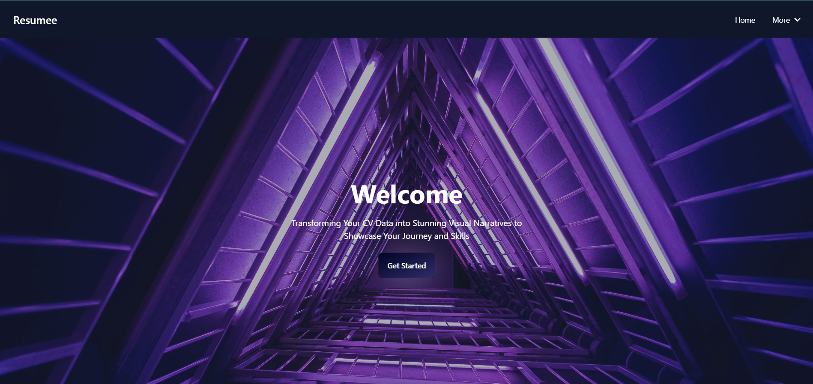
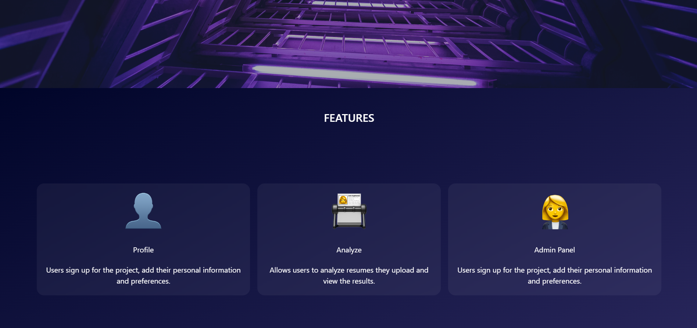
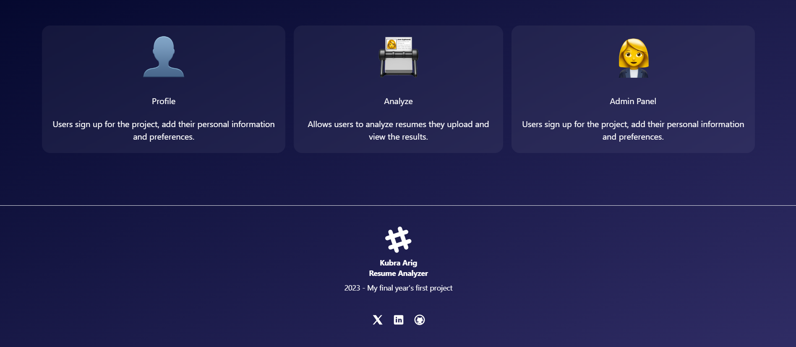
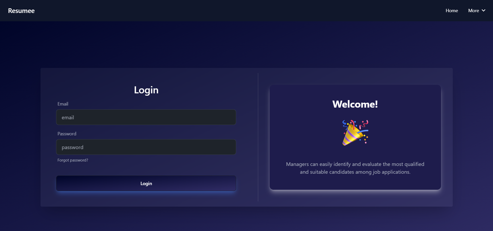
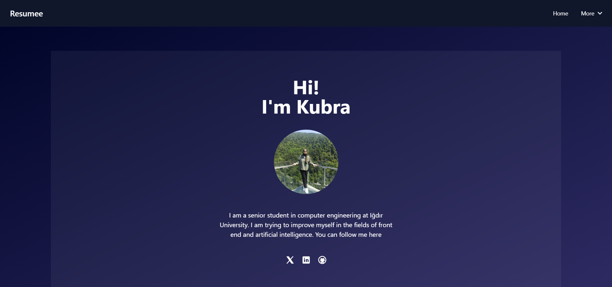
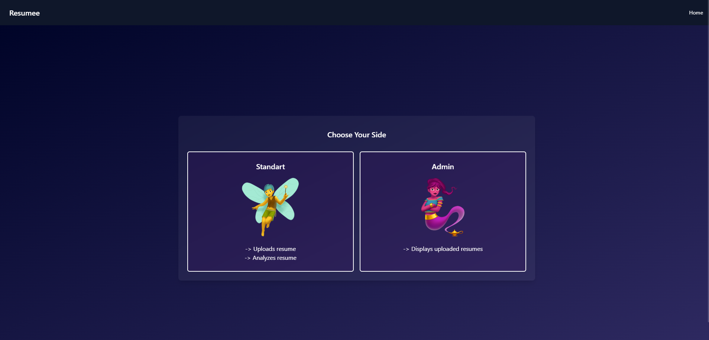
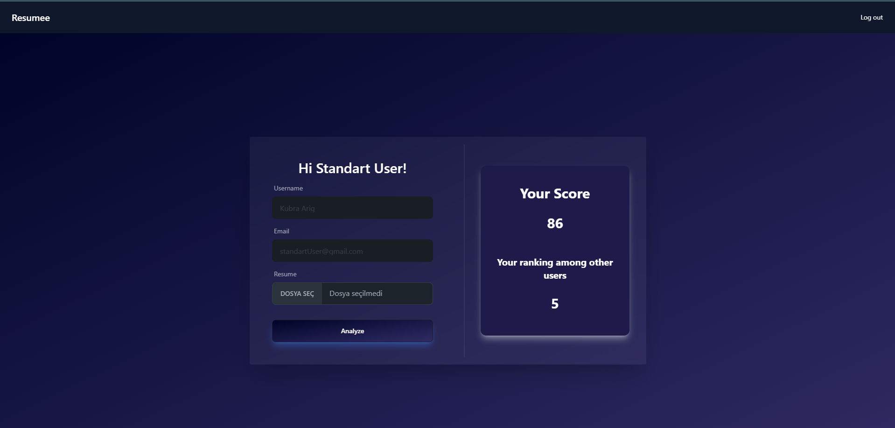

# Resume Analyzer

Things to do in the project:
* Back End entegration
* Analyze resume
* API

Completed:
* Home Page
* Login Page
* About Page
* User Type Selection Page
* Standart User's Page
* Admin Page

## View

